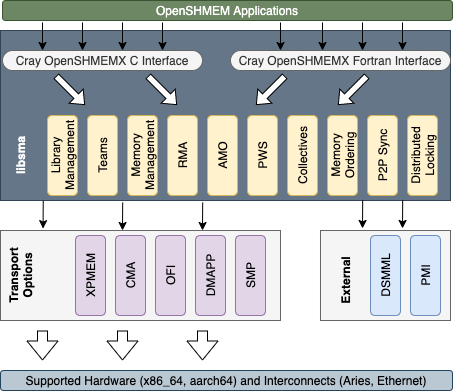

Cray OpenSHMEMX
===============

Cray OpenSHMEMX is a Remote Memory Access (RMA) library. It is a proprietary
software implementation of the OpenSHMEM standards specification and released
as part of the Cray Programming Environment software package. The Cray
OpenSHMEMX software stack is available as a standard compliant software package
on different architectures of HPE supercomputer systems.

OpenSHMEM is a Partitioned Global Address Space (PGAS) library interface 
specification, which is the culmination of a standardization effort among many 
implementers and users of SHMEM programming model. Refer
http://openshmem.org/ for more details on the OpenSHMEM programming model.

SHMEM has a long history as a parallel programming model. It is extensively 
used since 1993, starting from Cray T3D systems. For the past two decades the
SHMEM library implementation in Cray supercomputer systems have evolved through
different generations. The current generation of the SHMEM implementation on 
Cray XC and XK systems is called Cray SHMEM. Cray SHMEM is a proprietary SHMEM 
implementation from Cray Inc., which is OpenSHMEM standards compliant. The next
evolution of OpenSHMEM implementation for current and future generation 
exascale HPE Cray supercomputer systems is called Cray OpenSHMEMX.

This document contains public announcement information about the Cray
OpenSHMEMX software stack including release informations, updated API 
references, information on performance optimization and tuning parameters, 
supported environments and systems, and general backward compatibility details.

Overview
--------

Cray OpenSHMEMX software stack provides support for the OpenSHMEM standard
specific features as well as implementation-specific features. The examples of
the supported features includes teams and library management operations,
one-sided data transfer operations including RMA, AMO, and put-with-signal (PWS),
collective communication operations, symmetric memory management routines, 
memory ordering and point-to-point synchronization routines, and support for
distributed locks.

All the supported features are accessed using standard OpenSHMEM C and Fortran
interfaces. These features are implemented over different transport options 
like XPMEM, Cross Memory Attach (CMA), Libfabric and DMAPP. While XPMEM and
CMA are used for moving data across processing elements within the same node,
Libfabric and DMAPP are used to move data across nodes. The SMP transport
combines two transports one for inter-node and another for intra-node data
transfers. Cray OpenSHMEMX software stack is usable across different HPE system
architectures.

Latest News
-----------

.. list-table:: Latest Release Updates
    :header-rows: 1

    * - System Architecture
      - Release Version
      - Release Date
    * - HPE Cray EX
      - Cray OpenSHMEMX v11.7.0
      - December 2023
    * - HPE Apollo
      - Cray OpenSHMEMX v11.7.0
      - December 2023
    * - HPE Cray XC
      - Cray OpenSHMEMX v9.1.1
      - August 2020

The following changes were made in the latest release of Cray OpenSHMEMX
v11.1.0 on Cray EX systems:

1. Enabling manual-progress by default for OFI "verbs;ofi_rxm" provider
2. Allow using Cray OpenSHMEMX on HPE Apollo systems as a beta release. The 
   initial beta release is not performant and it is provided as a functional 
   test library
3. Fix padding issues on the symmetric heaps, to avoid internal library usage
   memory buffers to use the user-allocated symmetric heaps

The following changes were made in the latest release of Cray OpenSHMEMX v9.1.1
on Cray XC systems:

1. Fix issues in supporting lmod-based cray-openshmemx modules

For more details on the different released versions of Cray OpenSHMEMX, please
:doc:`refer the link <release_notes>`.

System Architectures
--------------------

Cray OpenSHMEMX is supported on HPE Cray EX, HPE Apollo, and HPE Cray XC systems.
The current support for Cray OpenSHMEMX on HPE Cray XC systems are in
maintenance mode, only bugfixes are provided and no new functional additions are
planned. Active functional additions and performance tuning is done on HPE
Cray EX and HPE Apollo systems.

The following table shows the availability of Cray OpenSHMEMX on different 
Cray systems.

.. list-table:: Availability of Cray OpenSHMEMX on Different Cray Systems
    :header-rows: 1

    * - System Architecture
      - Processor Type
      - Availability
    * - HPE Cray EX
      - x86_64
      - Available as primary library
    * - HPE Cray EX
      - aarch64
      - Planned support with Cray OpenSHMEMX v11.7.1
    * - HPE Apollo
      - x86_64
      - Available as primary library
    * - HPE Cray XC
      - x86_64
      - Deprecated support as evaluation library
    * - HPE Cray XC
      - aarch64
      - Deprecated support as primary library

Transport Options
-----------------

The following table shows the support for different transport options in Cray
OpenSHMEMX software stack on different system architectures.

.. list-table:: Supported Transport Options in Cray OpenSHMEMX
   :header-rows: 1

   * - System Architecture
     - Inter-node Transport Option
     - Intra-node Transport Option
   * - HPE Cray EX using HPE Slingshot 11 NIC
     - OFI (cxi provider)
     - XPMEM and SSHEAP (default) / CMA
   * - HPE Cray EX using HPE Slingshot 10 NIC (Ethernet)
     - OFI (verbs;ofi_rxm provider)
     - XPMEM and SSHEAP (default) / CMA
   * - HPE Apollo using NVidia Inifiniband
     - OFI (verbs;ofi_rxm provider)
     - XPMEM and SSHEAP (default) / CMA
   * - HPE Cray XC using Aries-Interconnect
     - DMAPP
     - XPMEM

Publications/Reference
----------------------

The proper citation of Cray OpenSHMEMX software stack is: Naveen Namashivayam, 
Bob Cernohous, Dan Pou, and Mark Pagel, “OpenSHMEM 2018: Fifth Workshop on 
OpenSHMEM and Related Technologies.” Baltimore, MD, August, 2018. “Introducing 
Cray OpenSHMEMX- A Modular Multi-Communication Layer OpenSHMEM Implementation.”

The corresponding Bibtex is:

.. code:: bash

    @inproceedings{naveen:openshmem:2018:crayopenshmemx,
        author = {Naveen Namashivayam and Bob Cernohous and Dan Pou and Mark
                  Pagel},
        title  = {Introducing Cray OpenSHMEMX - A Modular Multi-Communication
                  Layer OpenSHMEM Implementation},
        booktitle = {OpenSHMEM 2018: Fifth Workshop on OpenSHMEM and
                  Related Technologies},
        month = Aug,
        year = {2018},
        location = {Baltimore, MD, USA},
    }

Note
----
This website is in construction and updated regularly. There are place-holders
for various pages and will be completed soon.

.. toctree::
   :maxdepth: 3
   :hidden:

   intro_shmem
   tuning_parameters
   white_papers
   api_list
   release_notes
   api_glossary

